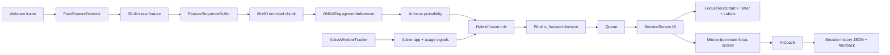

# FocusFlow AI

FocusFlow AI là ứng dụng desktop theo dõi mức độ tập trung theo thời gian thực trong các phiên học hoặc làm việc kiểu Pomodoro. Ứng dụng được thiết kế như một tiến trình nền, ưu tiên CPU thấp, pin tốt và độ ổn định lâu dài hơn là chạy các mô hình nặng. Hệ thống kết hợp Computer Vision, mô hình deep learning nhẹ, tracker hệ điều hành, giao diện CustomTkinter, và AI Coach sau phiên để tạo thành một luồng hoàn chỉnh từ camera đến phản hồi hành vi.

## Thiết kế ưu tiên CPU thấp

Triết lý sản phẩm của dự án là: chạy âm thầm trong nền, tiêu thụ ít tài nguyên nhất có thể, và chỉ dùng mô hình GRU nhẹ để suy luận kinematic features từ webcam. Khi tín hiệu AI không đủ chắc chắn, ứng dụng không cố gắng "đoán bừa" bằng một mô hình lớn hơn, mà dùng heuristic OS-level để bù lại độ chính xác trong các tình huống người dùng ngồi yên hoặc làm việc trong IDE/tài liệu.

## 1. Mục tiêu dự án

Mục tiêu chính của dự án là xác định trạng thái "đang tập trung" hay "đang mất tập trung" từ webcam, sau đó hiển thị trực quan cho người dùng và tổng hợp báo cáo cuối phiên. Toàn bộ phần suy luận production không dùng PyTorch; thay vào đó app chạy bằng `onnxruntime` để nhẹ hơn và dễ đóng gói thành file thực thi.

## 2. Kiến trúc tổng thể

Luồng hệ thống được chia thành 6 lớp chính:

1. Giao diện người dùng ở `ui/` chạy trên main thread.
2. Bắt camera, trích xuất đặc trưng, và suy luận ONNX ở `tracking/` chạy trong background daemon thread.
3. Tracker hệ điều hành ở `os_tracker.py` quan sát app đang active và tín hiệu sử dụng tài nguyên.
4. AI Coach ở `core_ai/` tạo phản hồi sau khi kết thúc phiên.
5. Tầng tiện ích đường dẫn ở `utils/` xử lý chạy bình thường và chạy khi đã đóng gói PyInstaller.
6. Các script hỗ trợ ở `scripts/` và `test_tracker.py` dùng để export model, test pipeline, và build ứng dụng.

### Sơ đồ luồng dữ liệu



## Hybrid System

Hệ thống mới không xem AI là nguồn quyết định duy nhất. Quyết định cuối cùng được tạo bằng một lớp hợp nhất đơn giản nhưng dễ kiểm soát:

1. AI trả về xác suất tập trung từ GRU.
2. OS tracker trả về tiến trình đang active, tên cửa sổ, và tín hiệu sử dụng CPU/RAM.
3. Nếu AI nghiêng về "Distracted" nhưng OS tracker nhận ra người dùng đang thao tác trong môi trường học/làm việc quan trọng như VS Code, Word, PDF reader, thì heuristic được phép override và trả về "Focused".
4. Nếu cả hai tín hiệu đều yếu hoặc không rõ, hệ thống giữ trạng thái an toàn là Distracted để tránh báo nhầm.

### Ví dụ hợp nhất AI + OS tracker

```python
from os_tracker import ActiveWindowTracker
from tracking.inference import ONNXEngagementInferencer

tracker = ActiveWindowTracker()
inferencer = ONNXEngagementInferencer()

prediction = inferencer.predict(enriched_chunk)
window_info = tracker.snapshot()

decision = tracker.fuse_ai_and_os_signals(
    ai_probability=float(prediction["focus_score"]),
    window_info=window_info,
)

is_focused = decision.is_focused
```

## Permissions & Privacy

Vì OS tracker cần biết ứng dụng nào đang active và mức độ sử dụng tài nguyên của tiến trình đó, ứng dụng phải xin quyền truy cập hệ thống ở lần chạy đầu tiên. Trên một số nền tảng, việc đọc active window hoặc process information có thể bị giới hạn hoặc yêu cầu cấp quyền bổ sung từ người dùng.

App phải giải thích rõ các điểm sau ngay trong UX:

- Chỉ dùng dữ liệu tiến trình và cửa sổ đang active để suy luận trạng thái tập trung.
- Không đọc nội dung tài liệu, không ghi log phím, và không chụp màn hình toàn hệ thống.
- Dữ liệu lịch sử phiên được lưu cục bộ trong `data/history.json` để phục vụ báo cáo sau phiên.
- Người dùng có thể từ chối tracker hệ điều hành, khi đó app sẽ quay về chế độ chỉ dùng AI.

Khi chưa được cấp quyền, hệ thống nên hiển thị một lời nhắc rõ ràng và cho phép người dùng chọn chế độ giới hạn quyền riêng tư.

## 3. Cấu trúc thư mục và vai trò từng component

### 3.1 File gốc của ứng dụng

- [main.py](main.py): điểm vào của ứng dụng. File này cấu hình `customtkinter`, tạo `FocusFlowApp`, và khởi động event loop.
- [os_tracker.py](os_tracker.py): module tracker hệ điều hành dùng để lấy active window/process, tính heuristic, và hợp nhất với đầu ra AI.
- [focusflow_app.spec](focusflow_app.spec): cấu hình PyInstaller để đóng gói app thành một file thực thi, bundling ONNX model, assets, data, và các hidden imports của `mediapipe`/`onnxruntime`.
- [requirements.txt](requirements.txt): danh sách thư viện runtime chính cho ứng dụng.

### 3.2 Nhóm UI: `ui/`

#### `ui/app_window.py`

`FocusFlowApp` là lớp cửa sổ chính, đóng vai trò router giữa các màn hình. Nó khởi tạo 3 screen:

- `DashboardScreen`: màn hình thiết lập phiên.
- `SessionScreen`: màn hình chạy phiên tập trung.
- `ReportScreen`: màn hình báo cáo sau phiên.

File này cũng giữ instance `AICoach`, và điều phối callback khi phiên kết thúc để chuyển sang background thread tạo báo cáo.

#### `ui/screens/dashboard.py`

Màn hình khởi động cho người dùng. Component chính gồm:

- tiêu đề ứng dụng,
- menu chọn thời lượng Pomodoro,
- nút bắt đầu phiên,
- tip nhắc người dùng giữ khuôn mặt trong khung camera.

Workflow: người dùng chọn số phút, bấm bắt đầu, và app gọi `controller.start_focus_session(minutes)` để chuyển sang màn hình phiên.

#### `ui/screens/session_screen.py`

Đây là trung tâm runtime của toàn bộ app. Nó quản lý:

- timer phiên,
- trạng thái camera,
- focus score hiện tại,
- progress bar,
- biểu đồ xu hướng focus,
- luồng camera và suy luận.

Các thành phần quan trọng:

- `TimerChip`: hiển thị thời gian còn lại.
- `FocusTrendChart`: vẽ đường focus score theo thời gian.
- `queue.Queue`: truyền frame và payload từ worker thread sang UI thread.
- `threading.Thread(daemon=True)`: chạy pipeline camera + MediaPipe + ONNX.

Màn hình này hỗ trợ các trạng thái:

- `WARMING_UP`: đang chờ đủ 60 frame.
- `NO_FACE`: không phát hiện khuôn mặt.
- `ENGAGED`: tập trung.
- `DISTRACTED`: mất tập trung.

#### `ui/screens/report_screen.py`

Màn hình báo cáo sau phiên. Nó hiển thị:

- số phút đã ghi nhận,
- focus trung bình,
- danh sách điểm focus từng phút,
- phản hồi từ AI Coach.

Khi mở report screen, app chạy AI generation ở background thread để không khóa giao diện.

### 3.3 Nhóm component UI: `ui/components/`

#### `ui/components/timer.py`

Chứa helper `format_seconds()` và component `TimerChip`. Nhiệm vụ của nó là hiển thị đồng hồ đếm ngược theo định dạng `mm:ss` hoặc `hh:mm:ss` nếu cần.

#### `ui/components/focus_chart.py`

Là một biểu đồ canvas đơn giản để vẽ trend focus score. Component này:

- lưu tối đa một số điểm cấu hình sẵn,
- vẽ grid ngang để dễ đọc xu hướng,
- cập nhật khi có score mới,
- hiển thị placeholder khi chưa có dữ liệu.

### 3.4 Nhóm tracking: `tracking/`

#### `tracking/detector.py`

`FaceFeatureDetector` dùng `MediaPipe FaceMesh` với `refine_landmarks=True` để trích xuất chính xác 30 đặc trưng mỗi frame.

30 feature này được tạo theo đúng thứ tự:

1. EAR mắt trái.
2. EAR mắt phải.
3. MAR.
4. Pitch, yaw, roll proxy.
5. 8 landmark XYZ được làm phẳng thành 24 giá trị.

Kết quả cuối cùng là vector shape `(30,)` cho mỗi frame. Nếu không phát hiện face, detector trả về vector 0 để pipeline vẫn chạy được.

#### `tracking/buffer.py`

`FeatureSequenceBuffer` giữ một cửa sổ trượt 60 frame.

Workflow của buffer:

1. Nhận từng vector 30 chiều.
2. Lưu vào `deque(maxlen=60)`.
3. Khi buffer đủ 60 frame, tạo chuỗi raw `(60, 30)`.
4. Tính velocity bằng sai khác frame-to-frame.
5. Tính standard deviation trên toàn chuỗi và tile lại 60 lần.
6. Ghép 3 khối này để tạo input enriched `(60, 90)`.

Đây là bước quan trọng nhất vì mô hình ONNX không dùng trực tiếp 30 feature thô, mà dùng 90 feature đã được enrich.

#### `tracking/inference.py`

`ONNXEngagementInferencer` tải `models/engagement_gru.onnx` bằng `onnxruntime`, chạy suy luận, rồi áp dụng:

- sigmoid để đổi logit thành xác suất,
- threshold mặc định `0.55` để xác định trạng thái,
- moving average trên 3-5 lần dự đoán gần nhất để giảm rung UI.

Đầu vào bắt buộc của inferencer là mảng `(60, 90)`. Đầu ra là dict gồm `logit`, `probability`, `focus_score`, và `state`.

### 3.5 Nhóm AI sau phiên: `core_ai/`

#### `core_ai/ai_coach.py`

`AICoach` là lớp chịu trách nhiệm tạo phản hồi sau phiên và lưu lịch sử.

Nó làm 3 việc:

1. Đọc `OPENAI_API_KEY` từ môi trường hoặc file `.env`.
2. Gửi summary JSON của phiên lên OpenAI `gpt-4o-mini`.
3. Lưu session record vào `data/history.json`.

Khi không có API key, ứng dụng vẫn chạy bình thường và trả về thông báo thay thế thay vì lỗi cứng.

### 3.6 Nhóm tiện ích: `utils/`

#### `utils/paths.py`

File này xử lý đường dẫn theo 2 chế độ:

- chạy từ source bình thường,
- chạy từ bản đóng gói PyInstaller.

Các hàm chính:

- `resource_base_dir()`: nơi chứa tài nguyên đọc-only như ONNX model và assets.
- `writable_base_dir()`: nơi ghi dữ liệu runtime.
- `model_path()`: trỏ đến `models/engagement_gru.onnx`.
- `history_path()`: trỏ đến `data/history.json`.

Đây là lớp rất quan trọng để app chạy được cả khi mở bằng Python lẫn file đóng gói.

### 3.7 Nhóm script hỗ trợ: `scripts/`

#### `scripts/export_to_onnx.py`

Script này export checkpoint PyTorch thành ONNX.

Workflow:

1. Load checkpoint từ `train_2/engagement_gru.pt`.
2. Khởi tạo `EngagementGRU` với tham số trong checkpoint.
3. Tạo dummy input shape `(1, 60, 90)`.
4. Export ra `models/engagement_gru.onnx`.

Script này chỉ dùng cho bước chuẩn bị model, không được gọi trong runtime production.

#### `scripts/build_exe.sh`

Script build PyInstaller một bước để tạo binary standalone. Nó gọi `pyinstaller --noconfirm --clean focusflow_app.spec`.

### 3.8 Script test độc lập: `test_tracker.py`

Đây là CLI test cho pipeline camera + FaceMesh + ONNX.

Nó giúp kiểm tra nhanh:

- camera có mở được không,
- MediaPipe có trích xuất được face landmark không,
- ONNX model có chạy được không,
- threshold 0.55 và smoothing có hoạt động không.

Script này vẽ trạng thái trực tiếp lên cửa sổ OpenCV, nên rất hữu ích để debug trước khi vào UI.

### 3.9 Nhóm training và dữ liệu model

#### `config.py`

Chứa toàn bộ hằng số dùng trong pipeline train và preprocess như:

- đường dẫn dữ liệu,
- kích thước sequence,
- feature dim,
- learning rate,
- batch size,
- số epoch,
- seed,
- cấu hình threshold và clipping.

#### `model.py`

Định nghĩa mô hình `EngagementGRU` gồm 4 phần:

1. `feature_extractor`: LayerNorm + Linear để nén/biến đổi input.
2. `Bi-GRU`: học quan hệ thời gian 2 chiều.
3. `TemporalAttention`: tập trung vào các frame quan trọng nhất.
4. `classifier`: trả về logit cuối cùng cho nhãn engaged/distracted.

#### `dataset.py`

`FeatureSequenceDataset` đọc manifest CSV và load các file `.npy` chứa feature sequence đã được trích xuất trước đó.

Nó cache tensor vào bộ nhớ để dùng trong training loop.

#### `extract_features.py`

Đây là pipeline tiền xử lý dữ liệu train:

1. Đọc labels đã xử lý.
2. Tìm video tương ứng trong thư mục raw dataset.
3. Chạy FaceMesh trên từng frame của video.
4. Tạo feature 30 chiều cho mỗi frame.
5. Chia video thành các segment theo sequence length.
6. Tính velocity và std để tạo enriched feature 90 chiều.
7. Lưu `.npy` và ghi manifest CSV.

#### `train.py`

Script huấn luyện model từ manifest feature.

Các thành phần chính:

- `FocalLoss`: xử lý mất cân bằng lớp.
- `EarlyStopping`: dừng sớm khi validation không cải thiện.
- `WeightedRandomSampler`: cân bằng batch khi train.
- `_find_best_threshold()`: tìm ngưỡng phân loại tốt nhất theo balanced accuracy và recall của lớp engaged.

Workflow train:

1. Load manifest.
2. Build dataset và data loader.
3. Train `EngagementGRU` bằng BCE/focal loss.
4. Validate, đo metric, chọn threshold.
5. Lưu checkpoint `.pt` để dùng cho export ONNX.

### 3.10 Thư mục kiểm thử: `tests/`

#### `tests/test_logic_oonx.py`

Đây là test logic ONNX phục vụ kiểm tra pipeline model. File này dùng để xác minh input/output shape và logic infer nhanh trước khi đem vào UI.

### 3.11 Thư mục dữ liệu và asset

- `assets/`: icon, logo, hình ảnh giao diện nếu có.
- `data/history.json`: lịch sử session đã lưu sau mỗi phiên.
- `models/engagement_gru.onnx`: model inference production.
- `train_2/engagement_gru.pt`: checkpoint PyTorch gốc để export lại ONNX khi cần.

## 4. Workflow chi tiết từng luồng

### 4.1 Workflow mở ứng dụng

1. Người dùng chạy `python main.py`.
2. `main.py` khởi tạo `FocusFlowApp`.
3. App tạo dashboard, session screen, report screen.
4. Người dùng chọn thời lượng và bắt đầu phiên.

### 4.2 Workflow realtime focus tracking

1. `SessionScreen.start_session()` bật worker thread daemon.
2. Worker thread mở webcam và khởi tạo `FaceFeatureDetector`, `FeatureSequenceBuffer`, `ONNXEngagementInferencer`.
3. Mỗi frame được đọc từ camera.
4. Detector trích xuất 30 feature hoặc trả vector zero nếu không thấy mặt.
5. Buffer tích lũy 60 frame và sinh enriched chunk `(60, 90)`.
6. Inferencer chạy ONNX, áp sigmoid, threshold, rồi smoothing.
7. Worker đẩy payload `{frame, state, focus_score}` vào queue.
8. UI thread gọi `_process_queue()` bằng `.after(15, ...)` để render frame, cập nhật label, progress bar, và chart.

### 4.3 Workflow tạm dừng và tiếp tục

1. Người dùng bấm `Tạm dừng`.
2. UI không dừng worker ngay, nhưng dừng cập nhật thời gian và ngừng ghi focus sample mới.
3. Khi tiếp tục, timer và focus chart chạy lại từ trạng thái trước đó.

### 4.4 Workflow kết thúc phiên

1. Người dùng bấm `Kết thúc` hoặc timer về 0.
2. App tổng hợp `minute_scores` và `average_score`.
3. `FocusFlowApp.on_session_finished()` chuyển sang report screen.
4. Một background thread gọi `AICoach.generate_feedback()`.
5. Kết quả được ghi vào `data/history.json` qua `save_session()`.
6. UI nhận feedback và hiển thị báo cáo cuối phiên.

### 4.5 Workflow AI Coach

1. Lịch sử focus theo phút được nén thành JSON summary.
2. JSON này được gửi tới `gpt-4o-mini` với prompt yêu cầu 3 câu ngắn, mang tính khuyến khích và hành động được.
3. Nếu API key không có hoặc gọi API lỗi, app vẫn trả fallback text để không làm gãy luồng UX.

### 4.6 Workflow export model

1. Chạy `python scripts/export_to_onnx.py`.
2. Script load checkpoint PyTorch từ `train_2/engagement_gru.pt`.
3. Model được export sang `models/engagement_gru.onnx`.
4. Ứng dụng runtime chỉ cần `onnxruntime` và file ONNX này.

### 4.7 Workflow đóng gói ứng dụng

1. Chạy `bash scripts/build_exe.sh` hoặc `pyinstaller focusflow_app.spec --clean`.
2. PyInstaller thu gom `main.py`, `tracking/`, `ui/`, `core_ai/`, ONNX model, data, assets, và hidden imports.
3. Ứng dụng chạy với cơ chế `sys._MEIPASS` để tìm tài nguyên khi đã bundle.

## 5. Dữ liệu đầu vào, đầu ra và định dạng quan trọng

### Input realtime

- Camera frame BGR từ OpenCV.
- 30 feature/frame từ FaceMesh.
- 60 frame/window từ buffer.
- Input ONNX: `(1, 60, 90)` dtype `float32`.

### Output realtime

- `focus_score`: giá trị 0..1 sau sigmoid.
- `state`: `ENGAGED` hoặc `DISTRACTED`.
- Frame đã vẽ overlay để hiển thị trong UI.

### Output sau phiên

- `minute_focus_scores`: danh sách điểm focus theo phút.
- `average_focus`: trung bình toàn phiên.
- `ai_feedback`: phản hồi từ OpenAI hoặc fallback text.
- `data/history.json`: log lịch sử session.

## 6. Cách chạy, test, và build

### 6.1 Chuẩn bị môi trường

```bash
conda activate thesis
pip install -r requirements.txt
```

Nếu cần export model lại từ checkpoint, cài thêm `torch`, `onnx`, và `onnxscript`.

Tạo file `.env` ở thư mục gốc nếu muốn bật AI Coach:

```env
OPENAI_API_KEY=sk-your-openai-api-key-here
```

### 6.2 Test pipeline camera + ONNX

```bash
python scripts/export_to_onnx.py
python test_tracker.py
```

### 6.3 Chạy ứng dụng desktop

```bash
python main.py
```

### 6.4 Build bản đóng gói

```bash
bash scripts/build_exe.sh
```

Hoặc:

```bash
pyinstaller focusflow_app.spec --clean
```

## 7. Ghi chú kỹ thuật quan trọng

- Phần production không dùng PyTorch; chỉ dùng ONNX Runtime.
- UI luôn chạy trên main thread để tránh lỗi Tkinter.
- CV, FaceMesh, buffer, và inference chạy trong daemon thread để không khóa giao diện.
- `utils/paths.py` là lớp cần thiết để app chạy được ở cả mode source và mode packaged.
- `data/history.json` là file ghi lịch sử runtime, nên cần quyền ghi ở thư mục cài đặt hoặc thư mục chạy ứng dụng.

## 8. Tóm tắt ngắn

Nếu nhìn ở mức cao nhất, FocusFlow AI gồm 3 khối:

1. Trích xuất và suy luận tập trung theo thời gian thực.
2. Giao diện Pomodoro có timer, camera, và biểu đồ live.
3. Báo cáo sau phiên bằng AI Coach và lưu lịch sử session.

Toàn bộ hệ thống đã được thiết kế để có thể chạy từ mã nguồn hoặc đóng gói thành ứng dụng desktop độc lập.