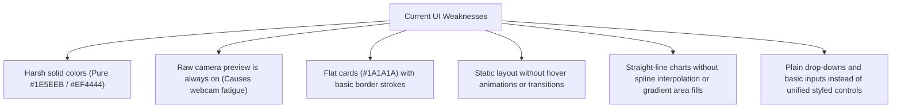

# FocusFlow AI Desktop Client: UI/UX Research & Propose Improvements

This document outlines a visual and interaction critique of the current FocusFlow AI PyQt6 desktop interface, draws design patterns from industry-leading focus applications, and proposes concrete UI/UX upgrades to elevate the application to a state-of-the-art premium product.

---

## 1. Competitive Analysis: Top Focus Apps

To design a premium interface, we analyze the design systems, color theories, and interaction models of the most popular focus and productivity applications.

| App Name | Platform | Key Visual Themes | UX Highlights | Best Practices to Adopt |
| :--- | :--- | :--- | :--- | :--- |
| **Opal** | iOS, Chrome | Vibrant gradients, glassmorphism, translucent card layers, rounded curves (24px+). | High-contrast visual blocklists, soft ring charts showing session completion. | Blurry transparent cards, neon/pastel indicators, high-contrast typography. |
| **Forest** | Cross-platform | Calming organic earth tones, soft warm greens, cozy pixel art illustrations. | Gamified visual feedback (growing trees), organic circular gauges. | Soft, non-harsh green colors, clean circular progress wheels, cozy UI elements. |
| **Endel** | Desktop, Mobile | Sci-Fi, cyber-minimalism, atmospheric glow, slow pulsing fluid animations. | Live wave visualizer, geometric dials, fully interactive soundscapes. | Subtle glowing drop shadows (`QGraphicsDropShadowEffect`), dark aesthetic, breathing animations. |
| **Session / Flow** | macOS, Web | Minimalist native look, extensive white space, heavy contrast fonts, soft shadows. | Elegant time counting wheels, floating overlay mode, subtle micro-actions. | Massive displays for timers (48px+ Outfit), hidden camera previews, fluid hover transitions. |
| **Rize** | Desktop | Developer dashboard, dark slate background, neon metrics, rich charts. | Spline-interpolated charts with gradient fills, status badges. | Spline area charts with semi-transparent fills, detailed component breakdown overlays. |

---

## 2. Deconstructing the Current FocusFlow UI

Evaluating the current FocusFlow desktop app reveals several areas for optimization:



### Key Areas for Redesign
1. **Camera Fatigue**: Always displaying the live webcam frame during work sessions causes subconscious anxiety. The user should have the option to toggle the preview off while maintaining vision extraction in the background.
2. **Flat Styling**: The current UI cards (`#1A1A1A`) look functional but resemble administrative dashboards. We need a glassmorphism style with faint white borders (`rgba(255, 255, 255, 0.08)`) and radial gradient backdrops.
3. **Timer Layout**: The timer is currently a simple text label (`25:00`). A modern design needs a large, breathing circular timer that shifts color dynamically according to the user's focus state.
4. **Harsh Component Metrics**: The XGBoost probability bars look raw and dry. They should be presented as minimal dashboard gauges with color-coded confidence levels.

---

## 3. Proposal: The "Glassmorphic Focus" Design System

We propose upgrading the client interface to a cohesive, high-end theme named **"Glassmorphic Focus"**, which uses fluid layouts, glowing states, and organic animations.

### 3.1 Color & Visual Palette Refresh

Instead of basic flat colors, the system will use a curated palette with soft neon glows to represent focus states:

```text
┌─────────────────────────────────────────────────────────────────────────────┐
│                            GLASSMORPHIC DARK THEME                          │
├───────────────────┬─────────────────────────────────────────────────────────┤
│ Background App    │ Deep rich space blue (#0B0F19)                          │
│ Card Panel        │ Translucent slate (#131B2E with 1px border)             │
│ Focus State       │ Soft Emerald Glow (Gradient: #059669 -> #10B981)        │
│ Distracted State  │ Soft Crimson/Rose Glow (Gradient: #E11D48 -> #FB7185)   │
│ No-Face Warning   │ Soft Amber Glow (Gradient: #D97706 -> #FBBF24)          │
│ Offline State     │ Translucent Lavender (#6366F1 -> #818CF8)               │
└───────────────────┴─────────────────────────────────────────────────────────┘
```

### 3.2 Key Typography Scale
Using **Outfit** or **Inter** display font family:
- **Timer Display**: `72px`, Semi-bold, tabular numbers (prevents layout shifting as seconds tick down).
- **Metric Cards**: Value `32px` Bold, Label `11px` uppercase with `1.2px` letter-spacing.
- **Section Headers**: `18px` Medium, Subtitle `13px` color `#64748B`.

---

## 4. UI Layout Specifications

We will implement three main screens to support this premium design:

### Home Screen: Cozy & Setup Dashboard
- **Welcoming Header**: Hello banner with local time and streak counts.
- **Visual Ring**: A soft circular progress widget displaying today's progress towards the focus goal (e.g., 50m / 120m).
- **Streamlined Setup**: Duration selection using a large circular radial dial, and a modern file selector for demo video files.
- **Recent Session Grid**: Translucent summary cards detailing historical metrics (XGBoost average scores, streaks, model run times).

### Active Session Screen: Calm & Deep Work
- **Centerpiece Circular Timer**: A large circle containing the digital timer. The circle's border pulses slowly (`QPropertyAnimation` on radius or opacity) to mimic breathing, changing from glowing Emerald (focused) to Amber (no face) or Rose (distracted).
- **Webcam Toggle Option**: A sleek pill-shaped toggle switch labeled "Camera Feed". When turned off, the video fades out smoothly and displays a dark card with a pulsing green wave animation (indicating tracking is active but hidden).
- **Minimalist Diagnostics Card**: Small, modern bar charts showing the component probability outputs (Final XGB, Boost XGB, Targeted XGB) using thin, rounded bars.
- **Spline Trend Chart**: FocusTrendChart updated to draw smooth curves (Bézier spline) with a translucent color gradient fill under the line.

### Report Screen: Post-Session Retrospective
- **Focus Score Card**: Large radial gauge showing the average focus percentage.
- **Session Stats Grid**: Detailed metrics shown as four responsive card panels with clean metric ratios (e.g., Deep Work vs. Total Time).
- **Spline Focus Timeline**: Interactive time-series showing focus fluctuations, with hover flags to reveal when distractions occurred.
- **Idempotency Status Badge**: Glowing indicator representing whether the report was successfully synchronized with GCP Firestore.

---

## 5. Concrete Component Enhancements

Here are the specific component classes we can build or refactor:

### 5.1 Dynamic Breathing Timer
```python
# A custom widget drawing a glowing circular ring that breathes via QPropertyAnimation
class BreathingTimerCircle(QWidget):
    def __init__(self, parent=None):
        super().__init__(parent)
        self.state = "FOCUSED"  # FOCUSED, DISTRACTED, NO_FACE
        self.progress = 1.0  # 0.0 to 1.0
        self.glow_radius = 15
        
        # Start a breathing loop animation using QPropertyAnimation on glow_radius
```

### 5.2 Spline Interpolated Focus Chart
Updating the painter path in `FocusTrendChart` to draw smooth Bézier curves:
```python
# Instead of raw path.lineTo(x, y):
# We calculate control points between current and next points to create a smooth spline curve,
# and fill the region beneath the curve with a transparent gradient to match the Rize app aesthetic.
```

### 5.3 Sleek Switch Control for Camera Preview
```python
# A modern animated toggle switch for camera preview visibility
class CameraVisibilityToggle(QWidget):
    def __init__(self, parent=None):
        super().__init__(parent)
        # Draws a smooth rounded capsule and pill with QPropertyAnimation slide
```

---

## 6. Next Steps for Implementation

To make these UI changes:
1. **Refactor `ui/theme.py`**: Add radial gradient CSS and unified font definitions.
2. **Enhance `ui/components/focus_chart.py`**: Add Bézier spline interpolation and transparent gradient area fill under the line.
3. **Rewrite/Update `ui/screens/active_session_page.py`**: Implement the layout changes, including:
   - Option to hide/show the webcam preview feed using a camera switch.
   - Clean component indicators layout.
4. **Improve the Home Page (`ui/screens/home_page.py`)** and **Report Page (`ui/screens/report_page.py`)** with matching visual assets and spacing.
